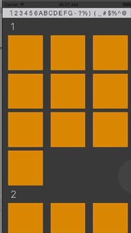

# Alphabet Slider

Provides an incremental slider, allowing the user to select from any arbitary values of your choosing--alphabet letters, numbers, values, or anything else.  Hook this up to a UICollectionView or a UITableView and use it as an index to quickly scroll between sections.  As a user scrolls through a table or collection, you can use delegate methods to update the value of this slider, which is a nice way of displaying the user's overall progress through the table or collection.

## Why would you want to use this?

* You want to have an incremental slider loaded with your own arbitrary labels
* You need an index for a UICollectionView
* You need an index for a UITableView, beyond the normal index that UITableView provides

## How do you install this?

**Install via CocoaPods:**
`pod 'AlphabetSlider`
Make sure you have `!use_frameworks` declared at the top of your `Podfile`.

**Install via copy/paste**
Copy all files within the `AlphabetSlider` subfolder inside your project; see the example project.  You may need to add `AlphabetSlider` to your project's embedded binaries.

Regardless which installation method you choose, you may need to build the project once to get Xcode to recognize the new library.

## What can you do with this?

* Set your own fonts, colors, and offsets via Interface Builder
* Set your own arbitrary labels via the `alphabet` property, which accepts an array of strings.

## How might you implement this?

Explained via a working example:

1. `git pull` this project
2. Open the root `xcworkspace`, which contains the AlphabetSlider project, and an example project.
3. Build the AlphabetSliderExample project

Explained via instructions:

1. In the story board, drag out a UIView and place it somewhere inside your view controller.
2. Set this view's class to `AlphabetSlider` from module `AlphabetSlider`.
3. Drag out an IBoutlet into your view controller's code
4. In your view controller's `viewDidLoad` method, set the outlet's `alphabet` property to an array of any strings you choose.
5. Also in the `viewDidLoad` method, call the outlet's `addTarget` method to connect your custom function to the `ValueChanged` event.

## How would you use this as an index view for a UICollectionView, UITableView, or UIScrollView?

See the implementation in the example project, which is meant to be as simple as possible.

Essentially, you want two things to happen with an index view:
1. When the index view is touched or scrolled, scroll the collection view.
2. When the collection view is scrolled, update the index view.

This is accomplished by using `collectionView(willDisplayCell:)` and `your_slider.addTarget(forControlEvents:)`.  To prevent these two scroll activities from interfering with each other, you will need to add state to your view controller.

## What is on the horizon?

1. Tests!
2. Vertical index
3. More precise positioning and scrolling

####Enjoy!
